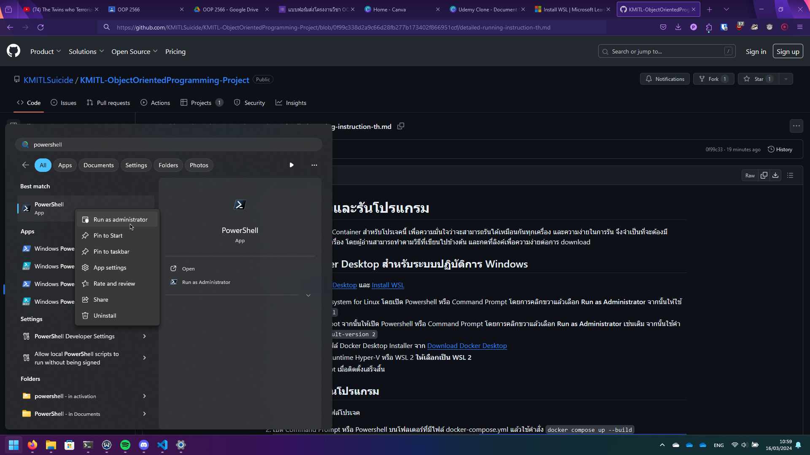
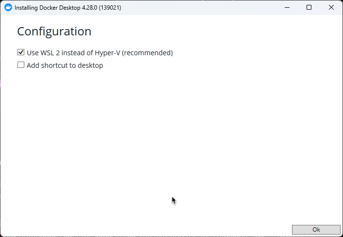
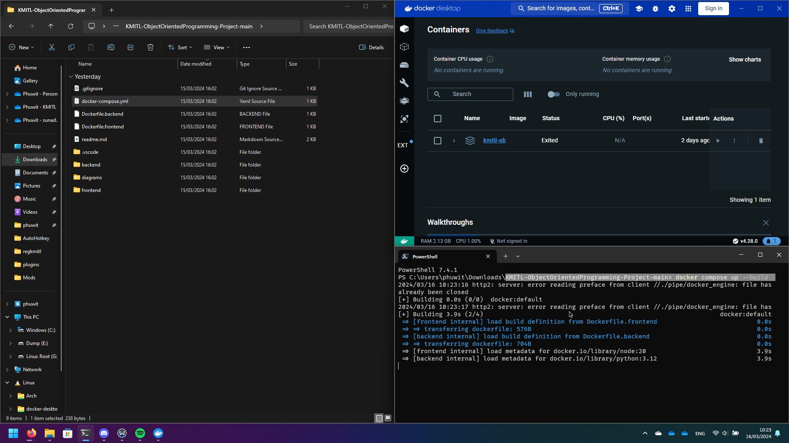
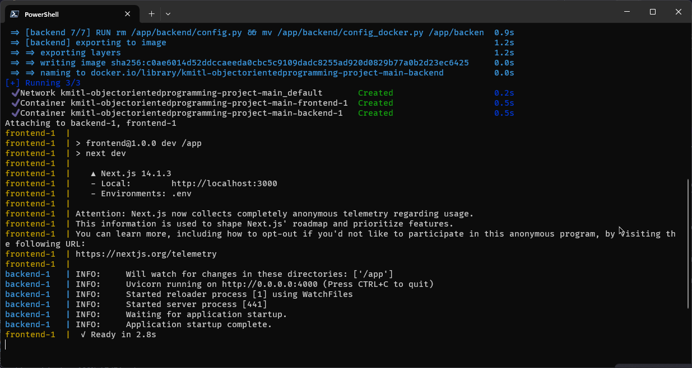

# วิธีการติดตั้งและรันโปรแกรม
เราได้ทำการสร้าง Docker Container สำหรับโปรเจคนี้ เพื่อความมั่นใจว่าจะสามารถรันได้เหมือนกันทุกเครื่อง และความง่ายในการรัน จึงจำเป็นที่จะต้องมี Docker Engine ติดตั้งในเครื่อง โดยผู้อ่านสามารถทำตามวิธีที่เขียนไปข้างต้น และกดที่ลิงค์เพื่อความง่ายต่อการ download


## การติดตั้ง Docker Desktop สำหรับระบบปฏิบัติการ Windows
อ้างอิงจาก [Install Docker Desktop](https://docs.docker.com/desktop/install/windows-install/) และ [Install WSL](https://learn.microsoft.com/en-us/windows/wsl/install)
1. ติดตั้ง Windows Subsystem for Linux โดยเปิด Powershell หรือ Command Prompt โดยการคลิกขวาแล้วเลือก **Run as Administrator** จากนั้นให้ใช้คำสั่ง `wsl --install`
    
2. ระบบอาจทำการ Reboot จากนั้นให้เปิด Powershell หรือ Command Prompt โดยการคลิกขวาแล้วเลือก **Run as Administrator** เช่นเดิม จากนั้นใช้คำสั่ง `wsl --set-default-version 2`
3. ดาวน์โหลดและเปิดไฟล์ Docker Desktop Installer จาก [Download Docker Desktop](https://desktop.docker.com/win/main/amd64/Docker%20Desktop%20Installer.exe)
4. ถ้ามีให้เลือกว่าจะใช้ Runtime Hyper-V หรือ WSL 2 **ให้เลือกเป็น WSL 2**
	
5. ระบบจะทำการ Reboot เมื่อติดตั้งเสร็จสิ้น


## การรันและใช้งานโปรแกรม
1. ดาวน์โหลดและแตกไฟล์โปรเจค
2. เปิด Docker Desktop ตั้งไว้
3. เปิด Command Prompt หรือ Powershell บนโฟลเดอร์ที่มีไฟล์ docker-compose.yml แล้วใช้คำสั่ง `docker compose up --build`
    
4. รอจนกว่ากระบวนการสร้าง docker image เสร็จสิ้น จะสังเกตได้จาก
    ```
    [+] Running 3/3
    ✔ Network kmitl-objectorientedprogramming-project-main_default       Created
    ✔ Container kmitl-objectorientedprogramming-project-main-frontend-1  Created
    ✔ Container kmitl-objectorientedprogramming-project-main-backend-1   Created
    Attaching to backend-1, frontend-1
    ```
    และสังเกตได้จากมี address ของ frontend `http://localhost:3000` **และ** backend `http://0.0.0.0:4000` ขึ้นบน Terminal
    
5. สามารถเข้าถึงหน้าเว็บไซต์ได้ที่ [http://localhost:3000](http://localhost:3000) หรือ [http://udemy.acceptablemess.com](http://udemy.acceptablemess.com)
6. สามารถเข้าถึงเซอร์เวอร์ได้ที่ [http://localhost:4000](http://localhost:4000) และ OpenAPI documentation ได้ที่ [http://localhost:4000/docs](http://localhost:4000/docs)